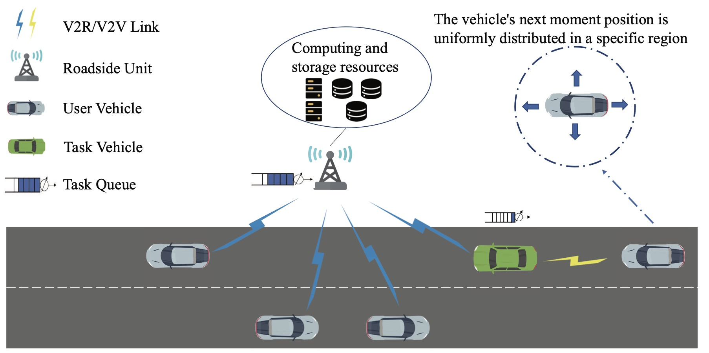

<!-- BEGIN VISITOR COUNTER 
-->
<!-- END VISITOR COUNTER -->
Hi! U are the -*th* visitor

  <h2> ✨  研究方向: </h2>
  <ul>
    <li>移动边缘计算</li>
    <li>计算卸载</li>
    <li>多智能体强化学习</li>
    <li>车载边缘计算网络</li>
</ul>
  <strong>🌱 个人网站: </strong>
    <a href="https://chenyuancqu.github.io" target="_blank" style="text-decoration: none; font-weight: bold; color: inherit;"> https://chenyuancqu.github.io</a>    
  <strong>🌱 CSDN：</strong>
    <a href="[https://chenyuancqu.github.io](https://blog.csdn.net/weixin_40433846?spm=1000.2115.3001.5343)" target="_blank" style="text-decoration: none; font-weight: bold; color: inherit;"> https://blog.csdn.net/weixin_40433846?spm=1000.2115.3001.5343</a>    

<h2> 🌟  Staring & Language </h2>
 
<!--star数量-->

   
  

<h2> 🕒  Recent Research </h2>

 

  Competition and Cooperative Computation Offloading for Intensive Heterogeneous Tasks in Vehicular Edge Computing Networks  
  <strong>Yuan Chen</strong>, Xiuhua Li*, Guozeng Xu and Ling Liu, Xiaofei Wang, and Victor C. M. Leung  

  <ul>
    <li>We investigate the problem of competitive and cooperative computation offloading for intensive heterogeneous tasks with RSU or TaV to effectively reduce the task execution latency and increase the task completion rate under VEC networks.</li>
    <li>We propose a multi-agent reinforcement learning algorithm based on C3O (MARC3O) to intelligently determine the computation offloading policy for each vehicle according to the state of VEC networks to improve task completion rate while minimizing task execution latency. </li>
    <li>We evaluate the proposed algorithm through extensive experiments. Simulation results show that the proposed algorithm can significantly reduce task execution latency and improve task completion rates. </li>
  </ul>

<h2>🧑‍💻  Technology Stack</h2> 
 
 
   
   
   
   
   
   
   
   
   
    

  

